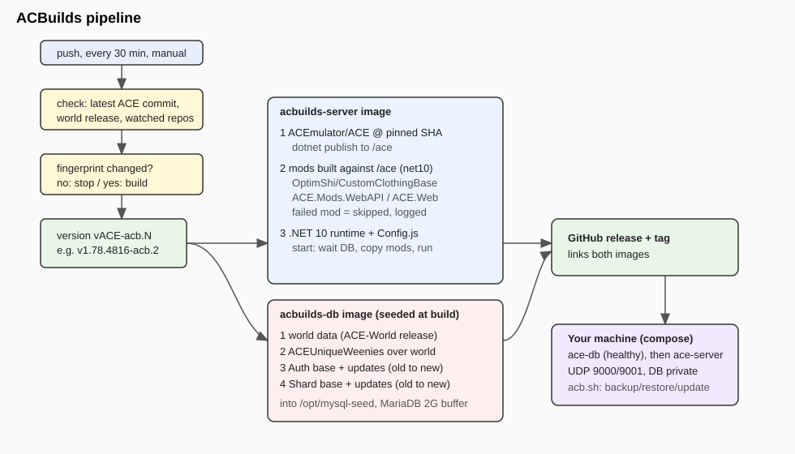
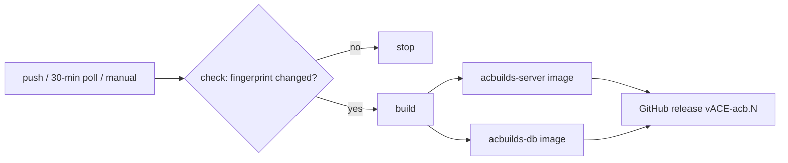

# How ACBuilds is built: repos, order, and what ends up where

## 1. When a build runs (`.github/workflows/build.yml`)

Triggers: a push to `main`, a manual run (`workflow_dispatch`, optional *force*), and a **poll every 30 minutes**. GitHub cannot webhook from repos we don't own, so polling is how upstream changes are noticed.

**Job `check`** (about 5 seconds):
1. Read the latest commit of `ACEmulator/ACE` `master`, the latest release tag of `ACEmulator/ACE-World-16PY-Patches`, and the latest commit of each watched repo (table below). Hash them into **two fingerprints**: a *stock* one (ACE master, world data, watched repos) and a *VR* one (`Thwargle/ACE` master, world data, watched repos).
2. Read the stock fingerprint from the published `acbuilds-server:latest` image and the VR fingerprint from `acbuilds-vr-server:latest`.
3. Each side is compared on its own: an update to `Thwargle/ACE` rebuilds **only the VR images**, an update to `ACEmulator/ACE` rebuilds **only the stock images**, and a change to the world data or a watched repo rebuilds both. Nothing changed and not a push/force run: **stop, nothing is built.**
4. Version = latest ACE release tag + our revision, e.g. `v1.78.4816-acb.2` (revision = how many `-acb.` tags already exist for that ACE version, plus one).

**Job `build`** (only if `check` says so): builds and pushes the server image, the database image, the VR server image and the VR database image (same Dockerfiles, `ACE_REPO`/`ACE_REF` pointed at `Thwargle/ACE`), then creates a GitHub release and git tag with the version and both image links.

## 2. Repos pulled in, and when

| Order | Repo | Used for | Where |
|---|---|---|---|
| 1 | `ACEmulator/ACE` (pinned to the commit SHA `check` read) | server source, plus `Database/Base` and `Database/Updates` SQL | server: compile. DB: SQL scripts |
| 2 | `ACEmulator/ACE-World-16PY-Patches` (latest release `.sql.zip`) | official world data | DB |
| 1b | `Thwargle/ACE` (master, pinned to a SHA) | the VR-enabled ACE fork: built with the SAME Dockerfiles into a second image pair (`acbuilds-vr-server`, `acbuilds-vr-db`) with its own database, port 9100 | server: compile. DB: SQL scripts |
| 3 | `titaniumweiner/ACEUniqueWeenies` | custom weenies (`weenies/*.sql`) loaded over the world data | DB |
| 4 | `OptimShi/CustomClothingBase` | mod: custom clothing colours and looks | server (`/opt/mods`) |
| 5 | `ACEmulator/ACE.Mods.WebAPI` (`Templates/ACE.Web`) | mod: web API/UI host | server (`/opt/mods`) |
| watched only | `aquafir/ACE.BaseMod`, `shemtar-90/AceForge`, `bDekaru/Melt`, `titaniumweiner/OpenDereth` | a change in any of them triggers a rebuild (via the fingerprint); nothing from them is installed yet | none |

## 3. Server image (`Dockerfile.server`), in order

1. **build**: .NET 10 SDK, shallow-fetch ACE at the pinned SHA, `dotnet publish` to `/ace`.
2. **mods**: for each mod, clone it and run `server/build-mod.sh`. That script rewrites the mod's hard-coded Windows `ACE.*.dll` references to `/ace/*.dll`, retargets net8.0 to net10.0, and builds into `/mods/<Name>`. A mod that fails to build is **skipped and logged** (`MOD SKIPPED`); it never breaks the image.
3. **runtime**: .NET 10 runtime image. Copies `/ace` and `/opt/mods`, then `config/Config.js` to `/ace/Config/Config.js` (ACE reads that path when it detects a container).

At container start (`server/entrypoint.sh`): wait for `ace-db:3306`, copy any baked mods that are missing from `/ace/Mods` (existing mods and their settings are never overwritten), hold stdin open (otherwise ACE's console loop spins), then run `ACE.Server.dll`.

## 4. Database image (`Dockerfile.db`), in order

1. **data stage**: fetch ACE's `Database/` folder, download the world zip, clone `ACEUniqueWeenies`.
2. **final stage** runs `db/seed-db.sh` once, at build time, against a private MariaDB:
   1. create `ace_auth`, `ace_shard`, `ace_world` and the `ace` user
   2. load **world data** into `ace_world` (first, because Shard updates join against it)
   3. load the **weenies** over it (a bad file is skipped)
   4. load `AuthenticationBase.sql`, then the Authentication updates oldest to newest
   5. load `ShardBase.sql`, then the Shard updates oldest to newest
   6. shut down cleanly and stash the data directory as `/opt/mysql-seed`
3. At container start (`db/entrypoint.sh`): if the `/var/lib/mysql` volume is empty, copy the seed in, then run MariaDB (2G buffer pool, override with `INNODB_BUFFER_POOL_SIZE`).

## 5. What runs on your machine

`docker-compose.yml` starts `ace-db` (healthchecked, port 3306 not published), then `ace-server` (UDP 9000/9001) once the DB is healthy. Volumes: `ace-db` (database), `./dats` (your AC client files), `./mods`, `./content`. Use `acb.sh` / `acb.ps1` to back up, restore and update (see the README).

